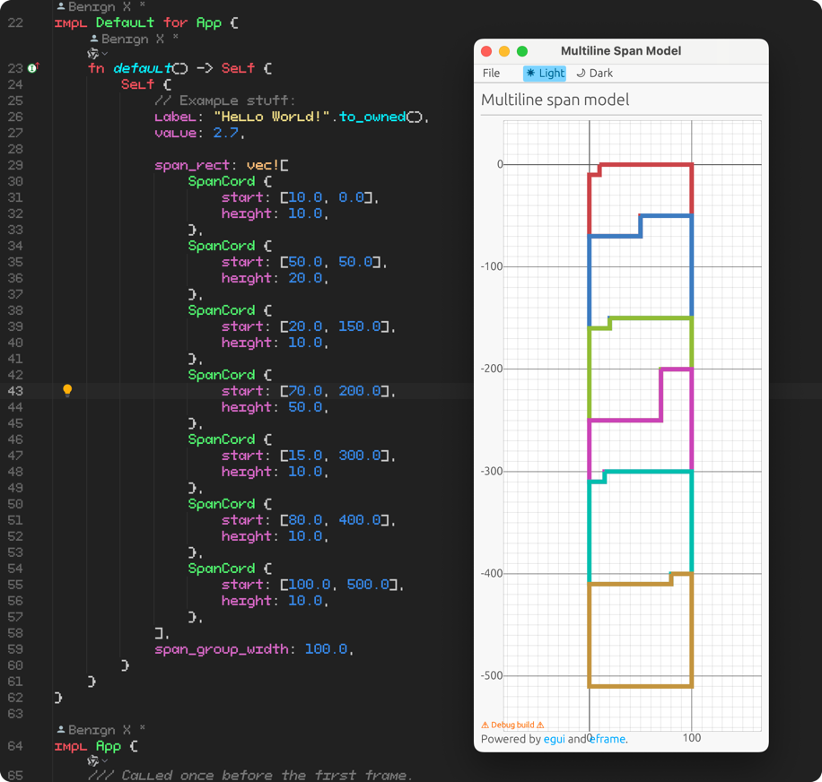

# Multiline Span Model

This repository is used to use three numbers to store the verification of span in a span group. As can be seen from the
screenshot, each complete area is a span.

## Snapshot

